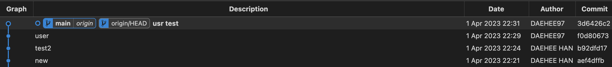

# Git

소프트웨어 개발을 할 때, 여러 사람이 참여하는 방식으로 개발의 효율을 올리곤 합니다. 

이때 중요한 점이 무엇일까요? 

팀원들이 개발 도중에는 수정된 내역을 다른 팀원이 바로 확인하고, 또 서비스에서는 배포된 소프트웨어의 버전 관리를 통해 개발의 효율성을 높일 수 있을 것입니다. 

- Git은 **소프트웨어 버전관리 시스템(VCS, Version Control System)**의 한 종류 입니다. 

- "프로그램의 소스코드를 관리하는 프로그램"인 것이죠.


---

## Git server & Git client

git은 여러가지 버전 관리 시스템 중에서도, 분산된 환경을 통해 소스코드를 관리합니다. 

분산 환경 시스템에는 중앙서버와 클라이언트가 존재하게 됩니다. 

- 이때 코드를 모아놓게되는 **원격 컴퓨터를 remote server**,

- 그 코드들의 사본을 받아 개발하는 **개인/지역 컴퓨터를 local client**라고 해봅시다. 


Git에서도 git server와 git client가 존재합니다. 

git client는 git server의 사본을 가지고 각자의 로컬 환경에서 개발을 할 수 있습니다.


git client와 git server의 종류는 아래와 같습니다.
 
- git client
    - ex) git CLI(Command-line interface), Visual Studio Code에 내장되어 있는 git

- git server 
    - ex) github.com, gitlab 등등


> https://docs.github.com/en

---

## Repository

- github상에서 우리의 프로그램을 담는 **저장소** 를 말합니다. 


개발하는 프로젝트를 담는 폴더라고 생각하시면 됩니다.


Repository에서는 우리 코드를 저장할 수 있을 뿐 아니라 커밋 히스토리, pull request등 협업을 위한 여러 작업을 할 수 있습니다. 


---

## issues


우리는 개발을 하면서 여러 소통을 해야할 때가 많죠. 

여기에는 bug가 발생해 debug을 해야하거나 새로운 기능을 만들어야하는 것도 포함될 것입니다. 

이런 상황의 대부분은 코드를 보고 의견을 교환하며 해결해야하는 경우가 많습니다. 

issues는 repository에서 이러한 기능을 수행합니다. 

- issues에서는 **'issue 생성'을 통해 해결하고 싶은 문제를 업로드하고 의견을 달 수 있습니다.**


- **해당 이슈가 어떤 것인지 알려주는 labels** 지정 가능


- **해당 이슈를 처리할 사람이 누구인지 Assignee** 지정 가능


---

## Clone

github의 repository의 내용을 내 로컬 환경(내 컴퓨터)에 복제하는 것 입니다.

이를 통해 로컬 환경에서 원격 환경의 github의 파일들을 받아서 개발을 할 수 있으며, 자동으로 git init이 됩니다.


- `git clone`

- `새창` - `GIT 리포지터리 복제 (Clone Git Repository)`


---

## git config


```
git config -- global user.name egoing
git config -- global user.email egoing@gmail.com
```





- New 컴퓨터에서 Author 변경 할때 도 사용, 처음 DAEHEE HAN으로 할시, commit 기록은 안됨, global config하여, 해결


로컬 환경에서 작업 후 commit을 진행할 때, 누가 해당 커밋을 했는지 기록하고 확인할 필요가 있겠죠? 

해당 작업을 수행하는 git 명령어가 git config 입니다. 


이는 git config에 global 옵션을 더해 해당 값을 기본값으로 활용하며 사용자의 이름, 사용자 이메일을 등록합니다.


---

### VS code  - Git Graph 

- commit history

### Source Control 

- commit 


---

## Commit

commit은 git 에서는 로컬 환경에서 버전을 저장하는 것을 의미합니다. 

이번 강의에서는 빈 repository에 file을 여러번 업로드를 하고 이를 각각 commit 해봅니다. 

우리는 *commit history* 을 통해 이를 확인할 수 있고 어떻게 바뀌었는지도 알 수가 있습니다.

---

## Push

로컬 환경에서 개발을 하며 commit을 진행하고, 난 이후 Push를 통해 원격 저장소인 github에 업로드 할려고 합니다. 

이때 활용하는 git 명령어가 git push 입니다. 

push가 되면 로컬 환경에서 개발한 코드 뿐 아니라 그동안 개발하면 중간중간 commit했던 이력들 또한 업로드 됩니다.


---

## Commit (local) vs Push (origin)


commit 이후, VS code 에서 sync change (변경 내용 동기화) 하면 자동 push 

- Commit


- Push


---

## Pull

우리가 로컬에서 개발을 하던 와중 다른 팀원이 본인의 작업물을 push 함으로 원격저장소에 변화가 생겼습니다.


- 이때 원격저장소의 내용을 현재 내 로컬환경에 반영하고 합쳐 개발을 계속하고자 합니다. 


- 이때 활용하는 명령어가 `git pull`입니다. 


- `git pull` == `fetch` + `merge` 가 동시에 진행되어, merge branch 생성되어 최신 상태 로 변경


ex 1 ) right에서 아무 작업도 안한 상태에서, left 작업 pull 하면, 자동으로 fetch + merge 됨


ex 2 ) right에서 작업 commit 목록이 있다면, left 작업 pull이 바로 안됨. right에서 pull을 하게되면 fetch 만 적용 후, merge 작업 내가 직접 해야 함


---

## Fetch & Merge 


fetch는 원격저장소에 있는 내용을 로컬 저장소로 가져옵니다.


우리가 로컬 환경에서 작업하던중 원격저장소의 내용을 팀원이 push 수정 했습니다. 


이때 우리가 개발한 내용을 원격저장소에 push를 할려고 하면 거절됩니다. 


- 그 이유는 원격저장소에는 팀원의 수정사항이 반영이 되어 있고, 이때 우리의 push를 받는다면 팀원의 수정사항이 overwrite이 되는 상황이기 때문이죠.


1. right에서 작업 전에 맨 처음에 pull (fetch + merge)를 진행, right 작업 시작 commit, push


2. right에서 작업 을 한 상태(commit)라면, pull(fetch)를 진행 하여, 두 브랜치를 비교후 merge 후, push
  


이를 통해 로컬 저장소와 원격 저장소와의 차이를 비교할 수 있으며,

이를 통해 충돌되는 상황은 발생하지 않는 지, 충돌한다면 이를 어떻게 해결하면 좋을지를 확인 한 후, merge를 통해 두 브랜치를 병합합니다. 

---


1. left, right 각 자 로컬 환경에서 commit 이후, left 만 원격으로 push


2. 이 상태로 right가 push하면, overwrite 에러 발생 (git rejected) 
    - left가 원격에 push 한 상태에서 right도 push를 바로 하게 되면, 겹치게 되서 error


- pull = fetch + merge


- left에서 push 수행 이후 , right에서 push 수행 시 거절 상태  - git rejected


3. 따라서 right 가 push 전에, left가 원격으로 push 했던 작업들을, right 가 pull(fetch) 을 먼저 해야합니다.


4. 기존 right 작업(commit) 상태 로  merge 했으므로, left꺼 그대로 가져옴. 이제 push 가능


---

- `git clone` 으로 github 원격 저장소(remote)의 repository 를 로컬 저장소(local) 로 구성 했음 

- 로컬에서 작업한 것을 github 원격 저장소(remote)에 올리고 싶다.


## git init


`git init` 명령어는 새로운 Git 저장소를 초기화하여, **로컬 저장소를 Git으로 관리할 수 있도록 설정하는 명령어**입니다. 


이 명령어를 실행하면, 현재 디렉토리를 Git 저장소로 설정하고 `.git`이라는 하위 디렉토리를 생성합니다.


`.git` 디렉토리에는 Git 저장소에 필요한 파일과 정보가 저장됩니다. 


이제 파일을 추가하고 커밋하면, Git은 이 정보를 .git 디렉토리에 저장하고 버전 관리를 할 수 있습니다. 


이렇게 초기화된 로컬 저장소를 다른 원격 저장소와 연동(`git remote`)하여 협업이나 백업 등의 작업을 수행할 수 있습니다.


1. Terminal : `git init`


2. VS code : 새로운 파일, 소스제어, 리포지토리 초기화 (`Initialize Repository`)


 

---

## git add


commit을 할 때 여러 파일의 수정사항 을 한번에 commit 하여 기록해도 좋지만.

한 개의 파일당 하나씩 commit 하여, 수정 사항을 detail 하게 memo 뿐만 아니라 다른 팀원들이 commit history를 볼 때 조금 더 수월하게 할 수 있습니ㅏㄷ.

이때 활용하는 명령어가 `git add` 입니다. 


- `git add` :  git commit에 포함될 파일을 지정합니다. 

- `git add .` : 여러개 파일 한번 에 설정 도 가능 


git add를 통해 하나의 파일을 지정하면, working directory에 있는 파일을 stage에 올린다 (스테이징) 합니다.

- staging area : add를 통해 commit 할 파일들을 올려 놓는 공간 
 


---

## 버전 분리

working directory : .git (Repository) 을 제외한 디렉토리 실제 작업 환경

staging area : add 

commited area : commited


1. working directory 에서 work1, work2, work3 파일 수정 작업

2. work1, work2 2개의 파일만 `git add (Staged Changed )` 스테이징

3. 커밋 시 work1, work2 만 커밋 됩니다.


---

## git checkout ( 버전 이동 )
 

`git checkout` 을 활용해 기존의 commit hisotry에 있는 버전으로 저장소를 변경한 후, 오류를 수정한 다음 다시 commit을 통해 버전을 업데이트 할수 있습니다.


`o` head 는 현재 working directory가 어느 버전인지를 가리킵니다.


`o` head 를 변경(git check)하여, 버전 변경


check out은 `o` head를 바꾼다 는 것과 같습니다.

main 는 기본 브랜치로 최신 버전이 어디었는지 가리킵니다.


- 빈칸 check out


- main check out


check out으로 이전 버전으로 이동 후, main으로 옮길때는 빈칸을 클릭하고 check out g하는게 아니라 main을 직접 클릭해서 check out 해야 합니다.


---

## git remote


- 선 원격 후 로컬 이 아닌, 선 로컬 후 원격 

- 이때 원격은 빈 상태여야 합니다.

- 이제 로컬 저장소에서 원격 저장소를 에드 시켜야 합니다. `Add remote`(원격 추가)


- 이때 remote name은 origin 으로 설정 후 push

- 여기서 origin 은 원격 저장소를 가리키는 별칭(alias) 이름(주소) 입니다.


git pull origin main' 명령어는 'origin'이라는 별칭(alias)으로 등록된 원격 저장소에서 'main' 브랜치를 가져와서 현재 로컬 브랜치와 병합하는 명령어입니다.


---

## `o head ->main` vs `origin/main `


- terminal `git log --oneline`


HEAD는 main을 가리키고 있습니다.

origin/main 원격 저장소의 주소도 main을 가리키고 있습니다.


---

work 5 commit 


working dir 가 현재 어디인지 가리키는 `o` Head 는 main 브랜치에 work5를 가리키고 있고,

원격 저장소(remote)의 주소를 가리키는 `origin` 은 main 브랜치에 work4 상태를 나타내고 있습니다.


즉 아직 push하지 않은 상태로, 현재 working dir 를 push 하여, 원격 저장소(remote)를 업데이트 할 수 있습니다.

---

## Create Branch


1. create branch

2. `o` Head 가 exp branch를 가리키도록 check out

3. exp 작업 수행

4. `o` Head 가 main branch를 가리키도록 check out

5. main 작업 수행

6. main branch 와 exp branch를 이동(check out) 하면서 작업 가능

7. main branch 와 exp branch 모두 push 가능

브랜치(branch)는 프로젝트을 바탕으로 독립적으로 개발을 할 수 있을 수 있는 저장소(작업영역)입니다.

저장소를 처음 만들 때, 동시에 만들어지며 프로젝트 version을 관리하는 branch를 master branch라 합니다. 

이후 기능 개발 시 master branch를 바탕으로 하거나 혹은 다른 branch를 바탕으로 또 다른 branch를 생성해 독립적으로 개발을 진행할 수 있습니다.


---

## Merge into current branch

Merge into current branch를 통해 master branch에 new branch 작업 을 병합합니다. 

이후 필요하지 않은 branch는 delete를 할 수 있습니다. 


- main branch 작업과 exp branch 작업을 merge

- 이떄는 merge 방향이 중요 합니다.


 
### 1. main이 exp를 병합하려는가 
 
1. main 브랜치 check out

2. exp 브랜치에서 merge into current branch,

### 2. if 충돌 

3. 현재 변경 사항 : main, 수신 변경 사항 : exp
    - exp 브랜치에서 작업했던 file 생성
    - exp 브랜치 작업과 main 브랜치 작업 비교
     
     
4. 충돌 (공동 작업이 있다면), 비교 후 accept 


5. 충돌 해결 파일 add (스테이징) 후 commit 


---

### 2. exp가 main을 병합하려는가


---

## Co-working

---

## Conflict

- 충돌 해결 후 add, commit 과정 후, push 

원격 저장소의 내용을 내려 받았을 때, 충돌이 발생 한 경우 세 가지 경우 중 하나를 선택 하여 다시 commit해서 통합된 버전을 만드는 것인데요. 
 
선택지는 다음과 같습니다.

1. 원격 저장소의 코드를 수용하는 경우 (남이 만든 코드를 반영)

2. 지역 저장소의 코드를 반영하는 경우 (내가 만든 코드를 반영)

3. 두 가지를 모두 반영하는 경우 (두 가지를 다 고려하여 수정)

다음 강의에서는 VScode의 기능을 통해 편리하게 위와 같은 방식의 해결책을 보여줍니다.


---

## Pull request (PR)

- merge request 라고도 함

Pull request란 직접 master 브랜치에 push하는 것이 아닌 master 브랜치로 부터 새로운 브랜치를 만든 다음 개발 내역을 해당 브랜치에 적용하고, 


그 내용이 master에 반영되기 전 검토를 해달라는 요청을 보내어 팀원들과 리뷰를 마친 후 반영 하는 방식입니다. 

그 과정이 아주 엄격하게 관리 될 수도 있고, 아니면 간단한 리뷰를 통해서도 가능합니다. 자세한 내용은 강의를 통해 확인해 볼까요?

---

## Pull request & Conflict


코드를 작업하면서 발생 했던 conflict들이 pull request에서도 발생 할 수 있겠죠? 바로 같은 파일을 수정한 2개의 브랜치가 순서대로 merge되는 상황이 그렇습니다.

앞에서 봤던 왼손씨와 오른씨의 개발과정을 기억하시나요? 다시 두분의 이름을 빌려 예시를 들어 보겠습니다. 

왼손씨가 a.py를 수정하고 "left" 라는 브랜치에 push한 후 PR을 만들었습니다! 하지만 공교롭게도 오른씨도 a.py를 수정하고 "right"라는 브랜치를 만들어 PR을 주셨네요.

이때 먼저 왼손씨의 코드를 리뷰하고 master branch에 "left" 브랜치가 merge되는 순간! "right"브랜치에서 conflict가 발생하게 됩니다. 

이때 까지 배운 개념들을 활용하면 이런 문제를 해결 해 볼 수 있습니다. 


침착하게 최신화된 master 브랜치를 "right" 브랜치에 pull 한 다음 다시 push 하면 해결 할 수 있겠네요! 자세한 실습을 영상을 통해 진행하면서 git을 다룰 수 있는 초석을 다져보도록 합시다 :)

## 
